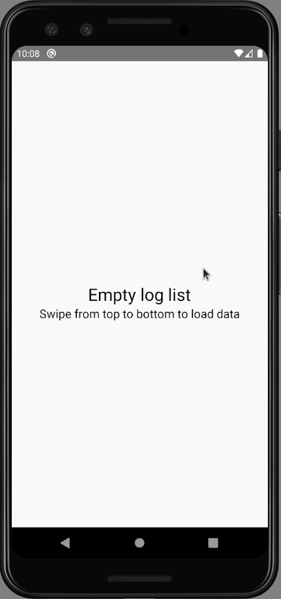

# POC: Pull to refresh

It demonstrates how to implements a slightly custom [Push-to-refresh](https://en.wikipedia.org/wiki/Pull-to-refresh) pattern using [Flatlist](https://reactnative.dev/docs/flatlist) component.

## How to run

| Description | Command |
| :--- | :--- |
| Install dependencies | `npm install` |
| Start Metro | `npm start` |
| Run app | `npm run android` |

## Preview

